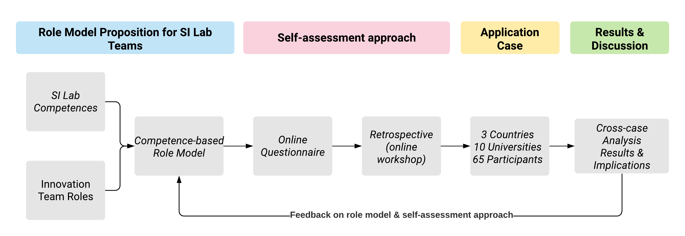
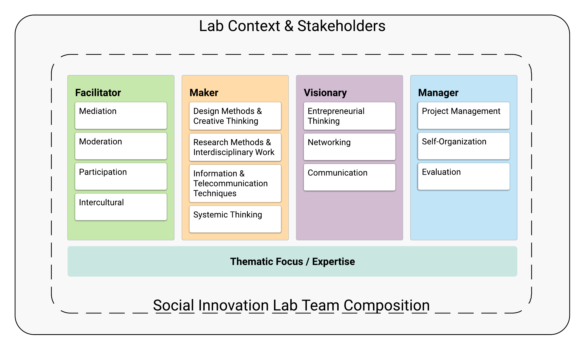

```{r, include=FALSE, echo=FALSE}
knitr::opts_chunk$set(echo = FALSE, 
                      fig.retina = 3, fig.align='center',
                      message = FALSE, warning = FALSE)
options(knitr.kable.NA = '')

library(tidyverse)
library(flextable)
library(officer)
```

# Introduction

Today's most critical challenges need to be addressed through systemic methods. Climate change, environmental degradation, health crisis, education inequalities, as well as employment issues and the reduction of poverty are some examples of those wicked problems characterized by their complexity, interdependence and contextual specificity [@Zivkovic2018]. Social Innovation (SI) then emerges as a branch of research, not only to help understand these societal issues but to facilitate the development of systemic strategies toward a transformative change of social practices, in order to solve social problems and meet local demands [@Strasser2019].

Specifically, the notion of SI Labs has recently become a subject of interest in the literature. SI labs emerge as an approach to keep up with the increasing changes and accumulating challenges that society faces, where more conventional approaches, which rely solely on techno-centric approaches, are insufficient [@Westley2015; @Jezierski2014]. Innovation labs are defined as semi-autonomous organizations dedicated to facilitating innovation processes by allowing multi-stakeholder groups to collaborate openly, with the purpose of creating and prototyping solutions to systemic challenges, while strengthening people's innovative and technological competences [@Lewis2005; @Gryszkiewicz2016; @Zivkovic2018]. In this sense, SI labs act as cross-pollinators of knowledge by creating dialogue, mixing voices and allowing for the emergence of new ideas and their translation into alternative solutions [@Wascher2019]. The manner in which these organizational structures operate often depends on the problem that is being addressed and on the context. This means that the people, the organizations and even the methods applied within a SI lab are in constant evolution [@Wascher2018].

The changing and permeable nature of the "lab" phenomenon entails a complex working environment which often leads to conditions of uncertainty. This is something regarding which authors have raised concerns, suggesting that teams in charge of leading an innovation lab should be able to deal with ambiguities, integrate multiple perspectives and facilitate cross-disciplinary work [@Osorio2020; @McGann2019]. There is a growing interest in how innovation labs can be used to address societal problems [@McGann2019]; governments, companies, universities, and even communities are increasingly turning to implementing their own "lab". These labs are becoming vectors for fostering collaborative learning, inclusive entrepreneurial thinking, systemic change and the transfer of innovation capabilities [@Delgado2020; @RezaeeVessal2021; @Rayna2019; @Camargo2021]. However, several questions arise when considering the composition and organization of the teams managing these initiatives [@Lewis2020; @Zivkovic2018]. This aspect is of paramount importance, especially at the early designing phase, to foster the future development and consolidation of such initiatives.

In fact, the assembling of innovation teams has been a matter of interest for a long time. Practitioners and scholars from both the public and the private sector have addressed and shared their experiences of the nature and characteristics of innovation teams across time. This is a vision that has known a constant evolution, referring, for instance, to the 80's and corporate-style innovation teams, whose nature depended mainly on the emergence of 'champions' capable of overcoming any obstacle, while additional roles were organized towards supporting them [@Roberts1982; @Jenssen2004]. Then, as open innovation practices became widespread, the idea of innovation teams progressively became more agile and adaptive, opening the door to the integration of multiple disciplines, and inspiring new ways of working and collaborating [@Hellstrom2002; @Hering2005; @Gemunden2007]. While the perception of lone innovators and isolated teams still seems to persist today, the increasing interconnection and complexity of the problems that we face as a society, the amount of information and knowledge that is continuously created, and the challenging task of making critical decisions with unforeseeable repercussions, explain why today's innovation teams are called upon to efficiently collaborate across multiple perspectives, disciplines and cultures [@Bjorklund2017; @Puttick2014-Teams].

This is not a minor issue, as the success of every innovation process of an organization lies in people [@Leonard1995]. Thus, understanding the dynamics of group work and team performance has been a topic of interest for the scientific community. In this regard, previous studies have tackled the issue from several perspectives. In terms of team theory for instance, @Belbin2010 gathers extensive research in her book to summarize her proposition of the nine key team roles at work. In this work, originally published in 1993, Belbin explains why, in fact, team roles encompass multiple factors such as personal traits, knowledge, skills, experience and even situations that will determine a person's behavior in group work or in a specific job. More specifically, studies on innovation teams such as the ones led by [@Kratzer2004; @Kratzer2006-A; @Kratzer2006-B] focus on examining the way factors such as team communication, conflicts or virtuality influence creative performance. Likewise, @DeCusatis2008 points out how team performance varies according to generational preferences, habits and the nature of the intended innovation. Specifically, the changing nature of the innovation process across time has opened the door not only for defining the required roles, but also the competences necessary to building successful innovation teams.

In this sense, the research work of [@Chatenier2010] and [@Podmetina2018] for example, propose specific competence profiles for open innovation teams, detailing the main tasks they cover, the main challenges they face and their underlying competencies. @Chatenier2010 point out that competence profiles are instrumental for the creation and development of innovation teams. However, besides the comprehensive and detailed model put forth, they also suggest that a single competence profile falls short of expectations when it comes to assembling effective innovation teams, specifically when determining which competences are required for each team member and for which role.

Despite existing research, the literature remains scarce when it comes to which competences are key to guiding the conformation of SI lab teams and what specific roles are required in this instance. This is a major issue for the successful implementation of an innovation lab initiative, since beyond physical and technological resources, human facilitation is a fundamental pillar in this regard [@Magadley2009]. Furthermore, how these aspects are weighed early on during a lab setup, and the lab's implementation context (i.e., private, community or university) determines the type of challenges a lab team will have to face [@Rayna2019]. More importantly, the strategies to overcome these challenges could either be driven or undermined, depending on the competences of the lab team, which would also reflect how effectively they could achieve the intended social impact [@Rayna2021]. Therefore, the main focus of this article lies in the identification of the key competences and roles that could help to build teams meant to be the bearers of SI processes. Our goal is to put forth a methodological approach for the early designing stage of SI lab teams. By means of a self-assessment tool, we intend to provide practical guidance for creating resilient lab teams while continuing to create awareness on the management of such organizational structures.

To this end, the article first elaborates on the concepts of SI lab, competences of SI labs and innovation roles. Next, a role-based framework is developed by comparing seven existing conceptual frameworks drawn from the literature on innovation teams and SI. Then, the proposed framework is operationalized through a competence-based assessment tool (online questionnaire), from which a self-assessment methodology is designed. This approach is subsequently tested within the framework of the Climate Labs project, an Erasmus+ initiative which aims to strengthen the applied research and innovation capacities of 10 Latin American Higher Education Institutions in Mexico, Brazil and Colombia, through the design and implementation of Social Innovation Labs for mitigation and adaptation to Climate Change. Results from this exploratory study show that the approach chosen is instrumental in characterizing the teams during the early stages of the implementation of a lab project within Higher Education Institutions, enabling them to elicit improvement strategies. Lastly, we present our conclusions with a discussion around the main implications of this work and suggested avenues for future research.

# Theoretical Background

## Social Innovation Labs

SI refers to new solutions provided to address increasing and unmet or inadequately met societal issues [@Gregoire2016]. It is understood as the new social relations (doing, organizing, framing and knowing) between people (e.g. producers and consumers, citizens and governments, refugees and native inhabitants, etc.) as well as between people and any other aspect of society (e.g. people and nature, producers and their products, etc.) [@Strasser2019]. SI has been described as being context specific; these new social relations often lead to novel practices that are meant to address social issues such as childcare, education, unemployment, crime prevention, population ageing or climate change [@Rayna2019; @Dias2019 ]. This means that the value sought through SI is primarily intended to benefit society rather than individuals [@Moulaert2014]. A key difference from other innovation approaches, such as technological innovation, is that here the focus is not necessarily on new technologies or material infrastructure but on the contribution to solving social problems with technology as a means to that specific end [@Mulgan2006; @Murray2010]. In that sense, SI is essentially about leveraging existing competences and expertise within the population to find more effective, efficient or sustainable ways to tackle current and demanding issues [@Strasser2019]. This also implies that SI solutions are a product of relational changes that prioritize values over status, purpose over profit, co-ownership over hierarchy, and collaboration over competition [@Strasser2019; @Gregoire2016].

Recently, the term SI lab has been used for framing the different forms of organization that bring together teams and methods with the intention of creating socially innovative initiatives [@Jezierski2014; @Westley2015; @Wascher2019]. The notion of innovation labs has been present in the literature for several years now [@Osorio2019-A], building on the more classic "lab" idea usually in association with the physical or natural sciences, and has established itself as a "safe haven for experimentation, focused on problem solving and solution creation" [@Bloom2016]. Among the constellation of labs, SI labs stand out through their specific focus on addressing complex social problems and enabling coherent action between multiple stakeholders [@Zivkovic2018]. They do so by providing the space and processes to facilitate collaboration among stakeholders across sectors, in order to develop new projects, products, tools, regulations, policies, etc. [@Wascher2018].

SI labs are distinctive because they foster the creation of dialogue, listening and mixing the different voices of the actors involved, and the creation of boundary objects (e.g. prototypes, illustrations, concepts, scenarios, and maps) used in knowledge co-production processes allowing a variety of actors to work together [See @Nilsson2015; @Lake2016; @Timmermans2020]. Ultimately, they act as cross-pollinators of co-creation methods, approaches and perspectives between groups, thus stimulating and channeling collective creativity so that new ideas may constantly emerge [@Jezierski2014; @Rayna2019]. Despite how promising innovation labs may seem, one should keep in mind that this approach is a response meant to keep up with the increasing and cumulative changes we are experiencing nowadays, and for which more conventional approaches are unsatisfactory [@Zivkovic2018; @RezaeeVessal2021]. That is to say, to embark upon such an initiative implies dealing with the uncertainty, ambiguity and tensions that are inherent to addressing such complex and changing conditions [@Osorio2019; @Jezierski2014]. For this reason, organizations willing to create their own "lab" need to be aware of the challenges and opportunities that this type of initiative entails.

SI lab teams perform in permeable and changing environments, where people and organizations come and go depending on the problem addressed and the parties for whom it is relevant [@Wascher2018]. These ever-changing conditions require teams that value and practice flexibility and agility so as to make the most of the ecosystem. Lab teams should possess a wide range of competences in order to be open to transitions and comfortable dealing with ambiguities; use multiple lenses to integrate multiple perspectives; and be able and willing to work across disciplines so that resources may be mobilized in creative ways [@Jezierski2014; @Puttick2014-Teams; @Rayna2021]. Still, the literature remains scarce when it comes to providing guidance on the competences needed for SI lab teams, or where to focus their development in order to succeed. In the next subsection, we explore this issue so as to establish a common ground for the set of competences needed for SI lab teams.

## Competence and Social Innovation Labs

From an organizational and managerial perspective, the development of human competences is a fundamental task in the path to innovation and successful organizations [@Leonard1995]. Understanding individual competences is key to enabling the performance and adaptation of teams and organizations in rapidly changing conditions [@Sandberg2000]. In general, the concept of competence is understood as the capability of an individual to deliver sustainable and effective performance in a specific domain, job, role, organizational context or situation [@Mulder2014]. A *competence* consists of various *competencies* that coherently cluster a set of knowledge, skills, attitudes and experience [@Mulder2014]. In that sense, competence profiles are often used to represent the functional and behavioral competencies that are required to successfully meet complex demands in a particular context [@Chatenier2010].

In the context of open innovation for instance, the work of [@Chatenier2010] proposes a competence profile for open innovation teams based on 20 semi-structured interviews and 2 focus groups with professionals who had participated in open innovation projects in the agribusiness sector. Based on their empirical findings, they build a profile composed of 4 main competence categories and 34 key competencies to accomplish three main tasks of an open innovation team: (1) managing the inter-organizational collaboration process, (2) managing the overall innovation process and (3) creating new knowledge collaboratively. They consider that a team which is competent in self-management, interpersonal management, project management and content management should be better prepared to deal with the challenges behind those main tasks.

In a similar way, @Podmetina2015 propose an open innovation specialist profile based on a large-scale survey with 528 European companies. By inquiring on the required and desired competencies for an employee to be able to implement open innovation, the authors build a profile consisting of six categories of competencies: collaboration skills, interdisciplinary skills, methodic skills, explorative skills, transformational skills and exploitative skills. This work will subsequently lead to the proposition of a competence model for open innovation in which direct links between competencies, key activities and roles are made at the organizational level [@Podmetina2018]. This holistic understanding of what is constitutive of a person's key aspects to perform a determined task or role is instrumental when assembling teams and training professionals [@Mulder2014]. Furthermore, competence profiles can also be used as an assessment tool of teams at work, in order to spark reflection processes [@Sandberg2000]. This ultimately allows managers to identify whether there is room for improvement and decide which type of actions are worth pursuing in order to enhance a team's performance, especially in complex and uncertain circumstances such as facilitating innovation processes [@Chatenier2010]. Nevertheless, although the studies conducted by [@Chatenier2010] and [@Podmetina2018] are presented as specific but not unique to the open innovation context, little has been studied in terms of SI and SI labs.

While the existing literature on SI labs constantly highlights the importance of the lab team and the selection of the staff, most of today's experiences and insights rely on generic statements such as the need for people with mixed profiles and backgrounds to reflect social reality, with both traditional skills such as project management and communications and innovation skills to get things done, or with networking skills to gather participants and build connections [@Puttick2014-Teams; @Kieboom2015; @Jezierski2014]. Acknowledging the importance of this issue, @Wascher2018 gathered from the literature a set of 14 key competences for a SI lab team (see Table 1). They consider that the combination of all of these competences should help the team to successfully manage and facilitate cross-sector collaborations. Furthermore, these teams tend to be relatively small, usually composed of a lab manager, an administrative staff and members dedicated to lab process facilitation [@Wascher2018]. Yet, there is no evidence that suggests what the required roles for a SI lab are and further, which competences are needed to effectively perform such roles.

```{r table1}
T1 <- read.csv("Tables/Table_1.csv")
set_flextable_defaults(fonts_ignore=TRUE)

T1 %>% flextable() %>% 
  set_caption("SI Lab list of competences retrieved from Wascher et al., (2018)") %>%
  fontsize(size = 9) %>% 
  width(j=1:2, width = c(1, 4)) %>% 
  theme_zebra()

```

## Innovation Teams & Roles

Reflecting on what roles or behaviors are required to facilitate innovation processes within an organization is not at all a new idea. One can refer to the notion of "champion" back in the 60's where the success of the innovation process was attributed to the one single person who was willing to fail for a dubious idea but capable of reaching success [@Roberts1982; @Jenssen2004]. However, nowadays the aim of reflecting on innovation roles is no longer to create heroes that prevail against all odds. Instead, it relies on building strong teams that are aware of their strengths and weaknesses, helping them find ways to overcome the barriers paving the way to the implementation of the intended innovation process [@Gemunden2007]. Indeed, innovation does not originate and sustain itself, rather, it happens thanks to the people who make it possible through teamwork that push the boundaries of their imagination, resilience and perseverance [@Kelley2005].

In this sense in particular, the literature on innovation teams and roles has evolved, as innovation processes have become more open, collaborative and social. This has also been the case for the roles needed to facilitate such processes. By delving into the literature on innovation teams we intend to illustrate the diversity of roles that members of an innovation team may play, and which could subsequently inspire the configuration of lab teams. Hence, seven models of innovation roles emerge from the literature (Table 2), models which we will now discuss.

One of the earliest innovation role models is the one proposed by [@Roberts1982]. This model consists of five roles that are needed to fulfil the critical functions in a technology-based innovation process. These are the *idea generator*, the *entrepreneur* or *champion*, the *project leader*, the *gatekeeper* and the *coach*. The intention was to highlight the key functions that were not always explicit in formal job structures. This also acknowledges the fact that, depending on the size of the team or the organization, some roles need to be filled by more than one person, while some individuals can perform more than one role, and that ultimately, the roles a person fills will change over the course of their career. More importantly, beyond considering a role as purely functional, one should consider a person's behavior within a team. Under the premise that people's useful behaviors can be grouped into a set of related clusters, in her book (originally published in 1993) [@Belbin2010] condenses the nine team roles which are an effective contribution to team performance: *plant*, *resource investigator*, *coordinator*, *shaper*, *monitor evaluator*, *teamworker*, *implementer*, *completer finisher* and *specialist*. Even though the Belbin team roles are not exclusive to innovation teams, they represent an important part of team theory that should be taken into consideration.

More recently, @Hering2005 present eight innovation roles, placing emphasis on the ones required for a generic innovation process. The authors detailed the features of what can be expected of these roles, rather than just titles or job descriptions. According to them, *connector*, *librarian*, *framer*, *judge*, *prototyper*, *monitor* and *storyteller* are the roles that should be sought when putting together an innovation team. The organization's commitment and a belief system are also deemed critical to creating the time and the resources necessary for innovation teams to deal with the uncertainty pertaining to any innovation process. Alternatively, @Kelley2005 published *Ten Faces of Innovation* based on their experiences at IDEO. The book presents ten descriptions of condensed persona meant to inspire which roles members of an organization should play to foster creativity and innovation. They consider that each role or persona helps bring specific values, tools, skills to the table, and therefore that it is important to ensure they are present in any innovation team. These ten roles are grouped by *learners* (anthropologist, experimenter and cross-pollinator), *organizers* (hurdler, collaborator and director) and *builders* (experience architect, set designer, caregiver and storyteller).

\newpage
\blandscape
```{r Table2, fig.cap="Table 2 - Role models of innovation teams over the years"}

T2 <- read_csv("Tables/Table_2.csv")
#T2 <- tibble(T2)
#set_flextable_defaults(fonts_ignore=TRUE)

T2 %>% flextable() %>% 
   delete_part(part = "header") %>% 
  add_header_row( values = c("References","Innovation team roles studied over the years"), colwidths = c(1,10)) %>% 
  hline_top(part="all") %>% 
  #set_caption("SI Lab list of competences retrieved from Wascher et al., (2018)") %>%
  fontsize(size = 8) %>% 
  bold(i = 1, j = 1:11, bold = TRUE, part = "header") %>% 
  bold(i = seq(1,by=2, len=8), j = 2:11, bold = TRUE, part = "body") %>%
  hline( i = seq(1,by=2, len=8), j = 2:11, border = NULL, part = "body") %>% 
  hline( i = seq(2,by=2, len=7), j = 1:11, border = NULL, part = "body") %>% 
  vline(i = 1:16, j = 1:1, part = "body")

```
\elandscape
\newpage

Based on 104 interviews with representatives of German companies and 42 cases from questionnaires, @Gemunden2007 propose a model to determine whether certain innovation roles are influential in adding to the success of new product development in the context of increasingly open innovation. They point out that not only innovation and technological experts are required (*expert promoter* and *process promoter*), but strong leadership (*project leader*) as well as good external relationships (*technology and market relationships promoters*). Moreover, they emphasize the importance of institutional support in the form of power promoters. Recently, [@Goduscheit2014] endeavored to build on the work initiated by [@Gemunden2007]. There, he seeks to further develop the concept of innovation promoters. This notion is based on the idea that innovation teams are meant to overcome the barriers and difficulties to successful innovations. His aim is to explore the interorganizational dimension between the innovation roles proposed by [@Gemunden2007] by analyzing how they interact/perform with/within multiple organizations. As a result, he further develops the innovation promoter model by moving from the original six roles to a proposition with nine roles: *seniority*, *top-level representative*, *technological expert*, *methodology expert*, *intra-organizational process*, *inter-organizational process*, *project process*, *technology relationship* and *market relationship*.

Finally, we refer to the very interesting work conducted by [@Nystrom2014]. These authors also build on the research work of [@Gemunden2007] by analyzing the roles needed in the context of open innovations. However, they center their research on the possible influence of such roles on innovation networks. For this, they studied 26 living labs and came up with a final proposition of 17 roles that network actors can adopt or create for an innovation project. The new roles identified are mostly related to users and the facilitators (e.g., *co-creator*, *orchestrator*, *contributor*), which correspond to living lab approaches encouraging multi-stakeholder engagement. They also state the importance of innovation roles to combine multiple perspectives, due to the increasing complexity of innovation projects. This in particular relates to the more systemic and transdisciplinary approach that is required for SI projects.

Throughout this review of the literature, one may observe that despite the diversity of perspectives, processes or names, authors agree that imbalanced teams and frequent changes can disrupt the way an innovation team performs. This is a challenge that should definitely be taken into consideration when setting up an innovation lab. However, none of the role models establish a direct link between the proposed roles and the relevant competences needed for a person to adequately fill these roles. Nor are any of the identified studies developed in a SI context. These elements are taken into account in the next section dealing with the proposition of this article.

# Methodology

Throughout the theoretical background presented above, we have explored the principles behind the notion of SI labs, along with the dynamics that lab teams must deal with in such contexts. Several questions arose as to which roles would allow a SI lab team to be better prepared to accomplish their mission, as well as what set of competences would be necessary for these teams to thrive under such conditions. Accordingly, seven innovation role models were retrieved from the literature on innovation teams, as well as a set of 14 key competences for SI lab teams. However, because of the lack of research work on the performance of innovation lab managerial teams, and more specifically on teams in the SI context, through this study we aim to establish a connection between innovation competence theory and actual innovation teams in order to hypothesize the essential elements that should be considered when putting together a SI lab team. To this end, we designed a four-stage process, as shown in Figure 1.

First, based on the literature reviewed, we proposed an adapted role model. Because none of the previous role models for innovation teams are rooted either in SI or in innovation labs, our aim was to use the 14 identified competences to establish a model proposition adapted to the context of our research. Following this, the model proposed was defined operationally as an assessment tool (online questionnaire) that was ultimately applied using a self-assessment approach. Given the practical motivation behind this exploratory study, which is to assist 10 Latin American university teams in setting up their own SI lab team in the framework of the Erasmus+ Climate Labs project, we opted for a self-assessment twin-track approach. The first goal was to use this approach to trigger reflection processes that would allow the university teams to increase their awareness of their actual position with respect to the expected roles. And the second goal was to have a comprehensive role characterization at the early stage of the project, for every lab team and according to their perception of the degree of mastery of the identified competences.

Due to the transcontinental nature of the Climate Labs project, the self-assessment approach was applied virtually by means of the online questionnaire and an online workshop. The proposed approach was designed so that each lab team member (including professors, researchers, students, and administrative staff) could be part of the process. We received a total of 65 answers along with the workshop results for each team. We then analyzed and discussed the results and insights in order to draw conclusions that could be used to provide guidelines for the future of the Climate Labs project but also to further develop this study.

```{r Fig1, fig.cap="Methodology overview", out.width='95%' }

```


# Proposition of a competence-based role model for SI Lab teams

Despite several insights from empirical studies and different statements regarding which functions or behaviors are possibly found in an innovation team, propositions and explanations fall short of expectations when it comes to the specificity of innovation lab teams. Therefore, we have reason to believe that by establishing a clearer connection between competences for SI labs and innovation team theory a model can be proposed. First, drawing from the 14 competences proposed by [@Wascher2018], we established a categorization according to the main functions that could be set forth. Based on the literature and according to the authors' knowledge and experience, four competence categories were identified, as illustrated in Table 3. This was done in consideration of the competences that most contribute to one of the following functions: (1) innovation process orchestration, (2) materialize systemic solutions, (3) spark connections and new ideas, and those that contribute to (4) organizing and measuring results.

```{r table3}
T2 <- read_csv("Tables/Table_3.csv")

T2 %>% flextable() %>% 
  set_caption("Categorization of SI lab team competences") %>%
  fontsize(size = 8, part = "all") %>% 
  width(j=1:5, width = c(1, .8, .8, .8, .8)) %>% 
  theme_zebra() 
  
```

Then, in order to gain a finer sense of how to better define these competences for innovation teams and their roles, we compared the four competence categories to the innovation roles found in the literature. At this point, we looked for similarities between the roles and behaviors that were historically recognized among innovation teams and the competences for SI labs. We found that all four categories were present in the seven innovation team role models (see Table 4). It is worth remembering that our focus for this study is the composition of lab teams. This means that while proceeding to this comparison our attention remained focused on the roles at the core of innovation lab management. This is why a fifth category emerges as "external roles", which refer to users or external parties that revolve around the network of lab stakeholders. By no means is our intent to diminish the importance of these roles, on the contrary, we would like to mention that these external roles should definitely be studied in depth at the further stages of the research. However, considering the usually relatively small size of innovation lab teams, especially in the early stages, we believe that these four categories constitute a comprehensive and pragmatic basis for this study.

```{r table4, fig.cap="Innovation Role Model Comparison"}
T4 <- read_csv("Tables/Table_4.csv")


T4 %>% flextable() %>% 
  set_caption("Innovation Role Model Comparison") %>%
  fontsize(size = 9, part = "all") %>% 
  width(j=c(1,2:6), width = c(1.2, rep(1,5))) %>% 
  #autofit() %>% 
  #theme_zebra()
   #delete_part(part = "header") #%>% 
  #hline_top(part="all") %>% 
  #bold(i = 1, j = 1:11, bold = TRUE, part = "header") %>% 
  #bold(i = seq(1,by=2, len=8), j = 2:11, bold = TRUE, part = "body") %>%
  #hline( i = seq(1,by=2, len=8), j = 2:11, border = NULL, part = "body") %>% 
  hline( i = c(2,5, 8,12, 14,19), j = 1:6, border = fp_border(color="gray", width = 0.1),  part = "body") %>% 
  padding(padding = 1, part = "body")
  #vline(i = 1:16, j = 1:1, part = "body")

```

Based on the previous work, we propose a competence-based role model for SI labs (see Figure \ref{fig:fig2}). This model is intended for the establishment of a minimal base of competences and roles that a SI lab team should bear in mind during the implementation of their project. A general description for each of the proposed roles is outlined below.

```{r fig2, fig.cap="Competence-based role model proposition", out.width='95%' }

```


## Facilitators -- They who set the tempo and orchestrate people's collaboration

This is probably the most distinctive role in an innovation lab team. The Facilitators are those who set the methodological tempo of the projects within the lab. They know exactly what strategy, tool or dynamics to use when divergence, convergence or a "simple" retrospective is needed. They get people involved and seek collaboration for every activity. When intentions and interests collide, facilitators keep everyone focused on the greater purpose. No collaboration is possible where there is discrimination and exclusion, so intercultural and transdisciplinary inclusion is a prime directive for them. What can be expected of facilitators in a SI lab team:

-   Design strategies, methods, and tools for orienting the innovation process throughout every project [@Belbin2010; @Hering2005; @Kelley2005; @Gemunden2007; @Goduscheit2014].
-   Provide guidance and mentoring to stimulate the professional and personal development of project teams and participants [@Roberts1982; @Kelley2005].
-   Get people involved and encourage collaboration in every lab activity [@Kelley2005; @Gemunden2007; @Nystrom2014; @Goduscheit2014].
-   Act as peacekeepers when a conflict emerges, maintaining the focus on project objectives and common goals [@Belbin2010; @Hering2005; @Nystrom2014].
-   Ensure intercultural inclusiveness in all lab projects or activities [@Kelley2005; @Nystrom2014; @Wascher2018].

## Makers -- They who make things happen

Whoever comes up with an idea usually needs support to make it become real. Makers leverage a diverse set of instrumental skills to understand every need and to prototype any solution. They do not hesitate to mix disciplines or to go out in the field in order to understand a problem. They shine at combining ideas and driving innovative concepts. Makers are driven by experimentation, iterating through prototypes crafted on available technologies. Acknowledging the complexity of every problem in a systemic manner is part of the way they see the world. What can be expected of makers in a SI lab team:

-   Understand needs and problems through the combination of multiple research methods and settings [@Kelley2005; @Nystrom2014; @Wascher2018].
-   Capture ideas, data, and any form of knowledge, restructure them and propose novel concept solutions [@Roberts1982; @Belbin2010; @Hering2005].
-   Help build physical (and digital) representations of solutions on an iterative basis [@Belbin2010; @Hering2005; @Kelley2005; @Gemunden2007; @Nystrom2014; @Goduscheit2014].
-   Propose alternatives to address the complexity of every problem and the systemic impact of each solution [@Nystrom2014; @Wascher2018].

## Visionaries -- They who push and connect

Refers to the type of person who always finds an opportunity where no one else sees it. These are the very same people who know how to easily create networks. They possess an inherent talent for communicating their ideas while remaining empathetic and sensitive to others. Their particular entrepreneurial mindset keeps them moving forward, in view of achieving their vision of the future and beliefs. What can be expected of visionaries in a SI lab team:

-   Provide a constant flow of ideas and project opportunities for the lab [@Roberts1982; @Hering2005; @Nystrom2014].
-   Build connections with communities and stakeholders to establish strong links between the lab, its stakeholders, and the territory [@Belbin2010; @Hering2005; @Kelley2005; @Gemunden2007; @Nystrom2014; @Goduscheit2014].
-   Create an emotional connection with people around the lab by sharing compelling stories regarding each project, event, success, or failure [@Hering2005; @Kelley2005; @Nystrom2014; @Goduscheit2014].
-   Go out and find opportunities for the lab whether these are new alliances, funding options or showcase scenarios [@Belbin2010; @Gemunden2007; @Goduscheit2014; @Wascher2018].

## Managers -- They who keep everything on track

Innovation lab initiatives can often be seen as fuzzy and accessory. Managers are there to organize, give sense and value to everything that happens in a lab. Because they are used to dealing with uncertain conditions, lab managers are exceptionally adept at handling innovation projects. They keep track of everything, detecting patterns of what works and what does not. Their ability to monitor metrics and results allows them to build bridges with their managerial counterparts from other institutions to defend the role of the lab in their ecosystem. Lab managers are capable of making decisions, a key asset in the highly complex contexts in which labs normally operate. What can be expected of managers in a SI lab team:

-   Handle any technical, financial, and legal issues pertaining to the lab and its projects [@Gemunden2007; @Nystrom2014; @Goduscheit2014].
-   Contribute to project planning while maintaining a balance between visionary solutions and achievable goals [@Roberts1982; @Belbin2010; @Kelley2005; @Nystrom2014].
-   Implement monitoring and assessment mechanisms to track the lab's evolution and communicate results [@Roberts1982; @Belbin2010; @Hering2005].
-   Have strong belief in themselves which helps them make decisions for the sustainability of the lab and its ecosystem [@Belbin2010; @Gemunden2007; @Wascher2018].

## Tool design: A self-assessment approach

The next step was to operationalize the proposed role model. Rather than relying entirely on a rationalistic approach where functional roles are predefined and team members are expected to fit into the assumptions, we sought to provide a reflection and awareness tool for lab teams as they design and implement their SI lab [@Sandberg2000]. In this sense, a self-assessment approach is instrumental in understanding the degree to which a person considers they are competent for a determined task or in a specific situation, while reflection processes are sparked [@Sandberg2000; @Allen2005]. An important advantage of following a self-assessment approach is that individuals have access to information about themselves that might otherwise be more difficult to access [@Allen2005]. However, it is also important to be aware that relying on self-knowledge often leads to problems regarding the reliability and validity of results [@Ward2002].

For this reason, the operationalization of our theoretical model first and foremost included the definition of short descriptions for each competence (see Appendix A), which constitute the basis of an online questionnaire as the first step to self-assessment. Accordingly, out of a total of 30 questions in the online questionnaire, 23 questions are directly related to the model criteria, 6 general questions are used for profiling purposes and the last question is an open one to collect feedback. Furthermore, and based on this structure, the questionnaire was also made available in three languages: Spanish, Portuguese and English. In terms of self-assessment levels, a scale from 0 to 5 with anchoring phrases was applied (see Table 5). In this scale, 1 corresponds to the level where respondents understand what the competence is but do not practice it, and 5, where they believe they have mastered the competence and are capable of developing new ways of applying it [@Dreyfus1986]. The 0 level was introduced for people who were not aware of, or did not understand what the competence was about, so as to reduce unintentional measurement errors [@Allen2005]. In order to address any ambiguity or lack of clarity, a test was performed with several members of the consortium, prior to applying the study to the Latin American teams. Adjustments were then made based on the feedback and test results. The English version of the final questionnaire can be accessed at <https://forms.gle/iZ1Lwyt1KUqrerb57>.

```{r table5, }

T5 <- read_csv("Tables/Table_5.csv")

T5 %>% flextable() %>% 
  set_caption("Self-assessment scale") %>%
  fontsize(size = 8, part = "all") %>% 
  #align(i = 1:6, j = 2, align = 'center', part = "body") %>% 
  width(j=1:3, width = c(1.5, 1, 2)) %>% 
  theme_zebra() 

```

Then, we designed a retrospective workshop in the form of a post self-assessment intervention, where we asked participants to reflect on the results of the questionnaire as a team. One of the main hypotheses posits that a competence profile resulting from self-assessment triggers discussion among lab team members concerning: a) the strengths and weaknesses they may have as a team; b) the potential role(s) that each member could play in the lab; c) the aspects to be developed and possible strategies for doing so. In this way, lab teams are stimulated to reflect on the current conception they have of their lab and on what needs to be strengthened [@Sandberg2000].

# Applying the self-assessment approach

## Sample and data collection

As previously mentioned, this study is conducted as part of the Climate Labs project, an Erasmus+ initiative which aims to strengthen the applied research and innovation capacities of a group of Latin American universities, via the implementation of SI labs for mitigation and adaptation to Climate Change. One of the project's main goals is to build multidisciplinary teams within universities in charge of designing a Climate Lab. Therefore, the self-assessment tool was conceived as a starting point to this project. The methodology was applied in 10 Latin American universities from Colombia (5), Mexico (2) and Brazil (3), between the months of April and August 2020.

The members of each team were asked to self-assess their SI lab competences individually by means of the online questionnaire, during the months of April and May. Later in June, a webinar was held with all the teams in order to share the preliminary results and introduce the retrospective activity as the second part of the methodology. Each university team was handed a customized report consisting mainly of their competence profile according to our four generic role propositions: Visionary, Maker, Facilitator and Manager. The intention was to trigger a reflection process to identify strengths and points of improvement and discuss them with the team. Based on the results, lab members were also asked to state which of the proposed roles they identified with the most and the least. Finally, they were requested to ideate potential strategies for filling their gaps as a lab team.

A total of 65 participants completed both the questionnaire and the workshop. Lab team size oscillated between 4 and 13 members. Among the respondents there were faculty members, administration staff, researchers and students, the latter category being only represented by three undergraduate students and one doctoral student. This was mainly due to the constraints of the global COVID-19 health crisis, with repercussions on each university's academic schedule. Nevertheless, the sample is still representative of who will lead lab implementation, which guarantees that insights drawn from this analysis will provide a real picture of a SI lab team in its early stages. Table 6 summarizes team composition by university.

```{r table6 }
T6 <- read_csv("Tables/Table_6.csv")

T6 %>% flextable() %>% #theme_booktabs(x, bold_header = TRUE) %>% 
  set_caption("Lab team composition and thematic focus") %>%
  fontsize(size = 8, part = "all") %>% 
  add_header_row( values = c("", "Members by Position", ""), colwidths = c(2,7,2)) %>% 
  border_inner(fp_border(color = "#e3e3e3", style = "solid", width = 0.1)) %>% 
  width(j=c(1,2, 3:9,10, 11), width = c(0.8,0.4, rep(0.3,7), 0.5, 2)) %>% 
  merge_v( j = c("Country")) %>% 
 footnote(
  i = 2,
  j = 3:9,
  value = as_paragraph(
              c("PR: Professor",
                "AP: Assistant Professor",
                "DI: Director",
                "AS: Administrative Staff",
                "RE: Researcher",
                "ST: Student",
                "OT: Other")
            ),
  ref_symbols = c("", "", "", "", "", "", ""),
  part = "header",
  inline = TRUE,
  sep = "; "
) %>% 
  align(align = "left", part = "all")
  


```

## Instrument internal consistency

There is interest in measuring the consistency of the tool. To do so, we chose to calculate Cronbach's alpha coefficient values, as they have been widely used for construct validation purposes [@Taber2018]. Due to the multidimensional nature of the questionnaire, the alpha coefficient was calculated for the groups of items associated to each role. Alphas for maker and manager are lower, 0.773 and 0.787 respectively, but they remain above 0.7 which is suggestive of consistency. Moreover, the alpha for visionary has an acceptable coefficient of 0.824 whereas it is higher for facilitator with 0.906. Far from reaching any conclusions in terms of reliability, these results only indicate an acceptable level of interrelatedness (or equivalence) among the grouped competences for each role, something we consider as positive at this exploratory stage and for the subsequent steps of this research.

## Competence self-assessment results

Figure 3 presents the results of the self-assessment for the whole sample (black line). Three additional profiles are shown (green, blue and orange dotted lines) which correspond to the three lab team cases that will be analyzed further in this section. Here, the radar is used to visualize the median-based profiles to provide a measure of the central trend among the sample (or specific team). The median is shown for each of the 23 questions to help the teams infer where strengths or weaknesses might be. From a general perspective, some points are worth describing. The overall sample of participants declared having a high level of competence for guiding others (level 4) in activities such as moderation, research methods, networking and self-organization. This was to be expected as there is a significant number of professors and directors among the respondents, who are probably more trained and experienced than team members holding different positions. However, one result worth highlighting is the low level of competence in ICT and entrepreneurial thinking, suggesting the existence of common gaps that could pose challenges for the future development of a SI lab.

```{r Fig3, fig.cap="Global profile based on results from competence self-assessment"}

```

## Retrospective results: A cross-case analysis

Based on the results of the self-assessment, the lab teams were invited to reflect on their competence profile while the role model was introduced along with the workshop steps. Due to space limitations, the results of the second part are described through three cases: Labs H, I and J. These cases were chosen because as a result of the self-assessment, they showed a lack or a low representation of the specific roles among their team members. This allows us to frame the analysis in terms of what conceptions the methodology elicits when specific roles are missing. A cross-case analysis is then conducted to discuss noteworthy observations and common elements in the way lab teams interpret results, self-positioning and what kind of actions or points of improvement were identified. Table 7 presents a summary of the retrospective results for the three chosen cases. We focused on analyzing and understanding how participants related to our role model and which self-declared roles emerged for each case. We were also interested in exploring how consistent (or not) the competence profile results were with the self-declared roles, as well as with the identified improvement actions. For instance, do teams lacking a specific role propose equivalent actions to fill that gap? Besides hiring or involving new people in the team, what other reflections or improvement strategies does the methodology elicit? With these questions in mind, we discuss some of the main insights in the rest of this section.

```{r table7 , ft.arraystretch = 1}

T7 <- read_csv("Tables/Table_7.csv")

T7 %>% flextable() %>% theme_booktabs(x, bold_header = TRUE) %>% 
  set_caption("Summarized results of retrospective") %>%
  bold(i = 1:29, j = 1, bold = TRUE, part = "body") %>% 
  hline(i = c(4,12,17,20), j = 1:4, part="body") %>% 
  fontsize(size = 8, part = "all") %>% 
  width(j=c(1,2,3,4), width = c(0.9,rep(2,3))) %>% 
  align(align = "left", part = "all") %>% 
  #merge_v( j = c("Retrospective Steps")) %>% 
  padding(padding = '0.2', part = "all")
  

```

The first part of the activity consisted in declaring which role each participant related with the most according to the role model and their competence profile. Some participants declared they identified with multiple roles whereas others with only one. Regarding the cases selected for this analysis, each case shows a relative low representation of one role in particular. For instance, Lab I does not have a self-declared maker. Lab J has only two visionaries and Lab H has only one facilitator and one maker. It is interesting to see whether the strengths or weaknesses correspond or not to their team profile. This is important, since the fact of failing to have someone identifying with, or related to, a specific role does not necessarily mean that they are not competent as a team in that respect.

In terms of strengths, the exercise seems to reveal direct links with the team's profile where high levels of competence are identified, as well as enable them to share information regarding additional key points that characterize them as a team. For example, aspects such as time working together as a team, the degree of SI and entrepreneurship institutionalization at the university and their strong links with the State government and local actors were highlighted by Lab I as their main strengths. Perhaps one remarkable characteristic is the fact that, as they stated, "all our students have a mandatory federal duty to dedicate 480 hours to social community service, where we can count on their talent and work". This is something that could prove useful for the lab once it is in operation. The team of Lab J recognizes themselves as "a Maker Team with great research capacity", as clearly the majority of its members self-identified as makers, which corresponds to high levels of competence in research and design according to their global profile (see Figure 3). They also stress the "good positioning" of several of their members in terms of management and decision-making at their university. Remarkably, despite a team profile that evidences a high level of competence for facilitation (see Figure 4), only one member of Lab H self-identified as facilitator. Still, as part of their strengths, they consider themselves "inclusive and respectful in moderating differences". They also outline systemic thinking, project management, pedagogical methods, networking and communications as strong points, as well as their knowledge in environmental disciplines and sustainable development.

As already perceived in the global profile, ICT competence is a common weakness that also appears in the retrospective for all three cases. In addition, Lab H and J identify entrepreneurial thinking as limited or with low experience whereas Lab I as well as H raised concerns regarding the slow and complicated administrative processes at the university. Specifically, according to their competence profile, team members of Lab H acknowledge a lack of experience in designing and prototyping innovation projects, and further, in building solutions to real problems in multi-stakeholder contexts. Similarly, the Lab I team reveals that this is their first experience in a lab that combines SI and climate change. They consider this a weakness as SI practices are not yet commonly included to the academic work of other faculties. In addition, they highlight that the lack of an emergency culture regarding climate action could be a barrier when it comes to bringing change or actions in their institution at the operational level. Lastly, the team of Lab J expressed the need for consolidating their visionary capabilities along with systemic thinking and evaluation methodologies. They also pointed out time management and the limited number of people available as weaknesses, because their team members were concurrently engaged in several other projects.

Moving forward in the retrospective, teams were then asked to synthesize what competences they needed to develop toward the design and implementation of their SI lab. Besides reaching some direct conclusions in terms of specific missing competences such as ICT or entrepreneurial thinking, the activity also helped them to draw some less obvious conclusions. For instance, the team members of Lab I stated that they were missing maker roles with strengths in ICT, creative thinking and systems thinking, and they pointed to the need for developing a culture of participation. However, they also mentioned the following as one of their conclusions, "we already have the strengths of the other roles, but we must keep increasing our knowledge and expand onto other roles". They also agreed that having a vision or a bigger picture of the scope of their SI lab was a key step that they needed to develop before they could move forward. On top of that, they recognized that it was also important to develop an adapted project management competence which recognized and urged the nature of SI projects. This is also in line with the members of Lab J who concluded that, despite having a high representation of the manager role, they still needed a project manager due to their time management issues. Some teams also identified competences or roles to be developed according to their thematic focus. The lab J team believes that they need to develop knowledge in Green Economy strategies while Lab H highlighted the importance of developing competences in living labs and social innovation for climate change.

The final step in the retrospective was oriented toward the identification of strategies and actions to improve or overcome the identified weaknesses or barriers. All three cases raised the importance of involving students in this process where research seedbeds, social service or internships were identified as possible mechanisms to this end. A second common strategy would be to develop missing or weak competences through training and learning communities. Team members seem to recognize the experimental and learning nature of their SI lab project, potentially allowing for the consolidation of both individual and team competences. More particularly, Lab H and J outlined collaboration with other universities and actors in their ecosystem as a source for fostering knowledge, exchanges and advice. Lastly, Lab I emphasized the importance of creating an identity around lab members and non-members alike, so that they might feel included and invited to participate.

# Discussion

The purpose of this study is to propose a methodological approach for guidance in the creation of SI lab teams. Since (social) innovation labs are still an emergent field in the academic literature, this article is a contribution to the literature inasmuch as it connects the theory of innovation teams to the competences required for managing SI processes. In this sense, we proposed a competence-based role model focusing on four main roles as a starting point for a SI lab initiative. Although the literature recognizes the multiplicity of roles in innovation teams and networks, in this study we chose to focus strictly on the aspects of management in the early stages of innovation lab setup. Prior studies have highlighted the fact that facilitating collaborative processes across disciplines, dealing with ambiguities, integrating multiple perspectives, and building and sustaining a shared intent in multi-stakeholder projects were some of the major challenges that innovation lab teams face today. Therefore, by focusing on the facilitation, making, visionary and managerial facets of lab management, innovation lab teams can find in this paper a deeper understanding of the roles and behaviors that could effectively assist in the implementation of the intended innovation processes.

Following an interpretative approach, the model was operationalized. As a result, the methodology put forth consists of a self-assessment tool, coupled with a retrospective workshop. To the extent that the roles required for an innovation lab have not yet been defined in the literature, the proposed model was considered as a basis that teams could not only use to position themselves at an individual level in terms of their own competences and their relation to the proposed roles, but also to position themselves at team level in order to identify and suggest improvement actions. Despite their relatively small size, instability and sometimes informal conditions, past experiences have shown that innovation lab initiatives needed to develop a human resource strategy, as this becomes fundamental when it comes to bringing in people with the right mindset to deal with social challenges [@Osorio2020; @Timeus2018]. Ultimately, this work calls for lab teams to not only focus their efforts on the projects and the different parties they interact with but also to develop *reflectum practicum* dynamics for sparking team development and cohesion [@Sandberg2000]. In this sense, our methodological approach should be seen not only as a tool for competence development but also as a way of closing the intent-gap within a team [@Gratton1994; @Mantere2007], which is essential to developing thriving SI lab initiatives [@Rayna2019; @Osorio2019].

On top of that, it is important to bear in mind the idiosyncratic nature of innovation labs. This is why our approach can be used by researchers and practitioners alike, to elicit conceptions of the competences required for their lab according to their own experience and context. While SI labs continue to proliferate around the world, universities in particular seem to discern in this type of initiative a means to stimulating deep transformations and enhancing their role as agents of change in stressful times [@Camargo2021; @Petersen2021]. This is precisely the case with the Climate Lab project and the cases we analyzed in this study. Applied, the self-assessment tool helps to draw a "picture" of the lab teams where specific strengths and weaknesses are revealed, but which are also linked to the intrinsic conditions of the universities to which they belong. Hence, this tool contributes to mapping the aspects which require attention in order to ensure the future development of university-hosted innovation labs, but which also help to identify and prioritize the areas in which these labs can generate greater value. Similarly, the recognition and socialization of competence gaps seems to enable the identification of collaboration opportunities with other labs and institutions. This could eventually lead to inter-collaboration between innovation labs in terms of complementary capabilities and/or services [@Memon2018].

Notwithstanding the implications of the self-assessment approach in SI labs research and practice, this exploratory work comes with several limitations that should be addressed in future research. Although the competence-based role model proposed in this paper takes into account a broad spectrum of the literature on roles and competences for innovation, there is still plenty of room left to investigate the underlying competencies for each role and each competence, in terms of knowledge, skills, aptitudes and experience [@Chatenier2010]. Further theoretical and empirical research could explore the dynamics involved in the management of socially innovative processes and how they differ from open innovation teams, for example [@Podmetina2018]. In addition, any self-assessment approach suffers from subjectivity. Therefore, the results of the questionnaire should not be seen as absolute statements, on the contrary, they should be interpreted by providing the appropriate space for collective reflection at the lab team level. The use of a competence profile should motivate the development of human talent, a process that consists of chained events rather than one single intervention at the start of an innovation lab project [@Sandberg2000].

Lastly, our choice of only four roles may be perceived as excluding the multiplicity of behavioral and functional roles recognized in the field of innovation. However, the aim of this work is not to overlook the importance of previous studies; on the contrary, it seeks to open new research avenues for a deeper analysis in terms of innovation lab management and the talent in charge of carrying out its mission. In practical terms, this work offers a starting point for nascent lab teams with limited resources, which is often the case for SI labs, particularly in contexts such as Latin America [@Osorio2020]. Future research efforts should focus on the evolution of role profiles over time and on the competences that prevail for projects addressing social challenges [@Rayna2021] (i.e., what does it mean to be a facilitator, maker, visionary or manager for climate change adaptation and mitigation?). Further empirical studies could also assess which aspects of the proposed model are most influential in the performance of an innovation lab [@Caccamo2020].

# Conclusion

This article explores the competences and team roles that could guide the conformation of a SI lab team. Consequently, it develops a competence-based role model consisting of an existing set of 14 competences for SI gathered from the literature, which are then organized in 4 generic roles specifically for innovation lab teams. The methodology, composed of an online self-assessment questionnaire and a retrospective activity, provides an interpretative approach for SI lab teams to position themselves with regards to their competence profile and the proposed roles, while identifying improvement strategies. Applied to 10 lab teams from Latin American universities, the methodology proved instrumental in identifying the teams' strengths and weaknesses as well as key actions that could guide team conformation. The results not only contribute to building knowledge from the team and managerial point of view on the (emergent) SI lab literature, they also share the detailed conceptions and experiences of nascent lab teams in a Latin American context.

This study is not without limitations. The self-assessment approach is often criticized for the subjectivity of its results, which could be problematic when looking for reliability and results validation. However, the purpose of this work is not to produce generalizable results on which roles a SI lab should have and its underlying competences, but rather to provide a methodological approach to support the assembling of such heterogeneous teams. Finally, further research efforts should explore in greater depths how team roles perform and interact within an innovation lab, in order to better understand functional and behavioral roles. Furthermore, adding a processual perspective to this study could provide insights on the changes in roles linked to an innovation lab's evolution.

# Acknowledgements

This work is part of the Climate Labs Project co-financed by the European Commission through the Erasmus+ Programme under Grant Agreement No. 610032. We would like to thank all the members of the Climate Labs consortium for their openness and active participation in the proposed activities that make this study possible. This study also received financial support from COLCIENCIAS Grant Program 785-2017 which funds Ferney Osorio's PhD thesis research.

\newpage

# Bibliography
